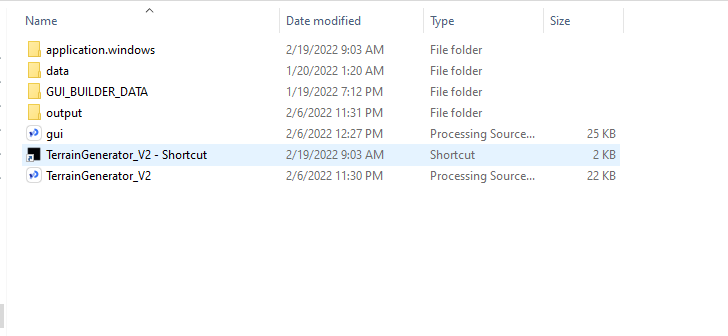
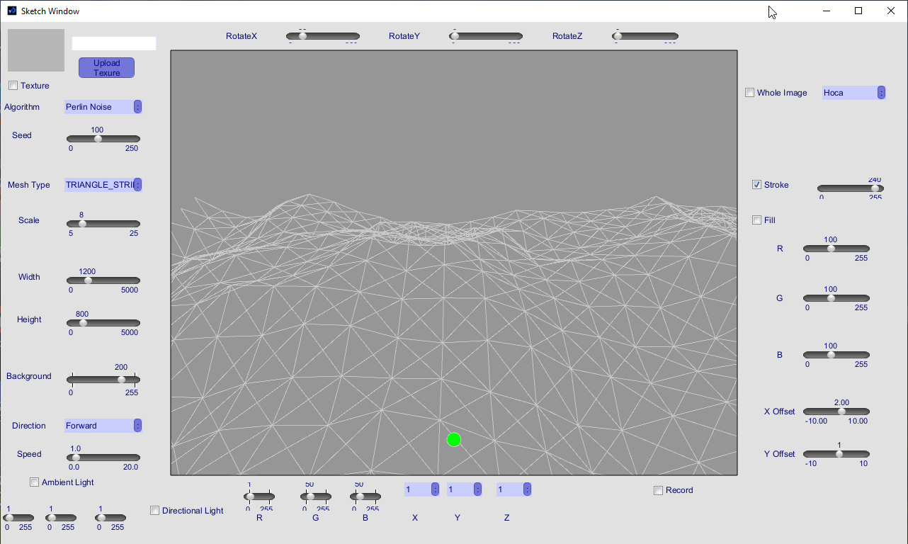
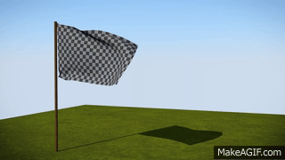

TerrainGenerator: A Procedual 3D Terrain Generator
=================================================

A simple procedual 3D terrain generator made using *[Processing Language](https://processing.org/)* , meant as a project for a Computer Graphics class. However, it has been extended with functionalaties like Texture Mode, WholeImage mode and Recording (see: [Usage](#usage).)

Table of contents
-----------------

* [Introduction](#introduction)
* [Installation](#installation)
* [Usage](#usage)
* [Known issues and limitations](#known-issues-and-limitations)
* [License](#license)
* [Authors and history](#authors-and-history)
* [Acknowledgments](#acknowledgments)

Introduction
------------

A simple procedual 3D terrain generator made using [Processing](https://processing.org/) Language, meant as a project for a Computer Graphics class. The initial goal was to learn how to turn a basic 2D grid into a moving 3D terrain, but it later evolved into displaying pictures and textures on the grid.

The program offers a UI that allows the user to tweak various parameters such as the width/height of the grid, movement speed/direction ...etc. The changes are reflected in the rendered scene immediatlly.

The program also demonstrates the importance of having a good organic noise generating algorithm, as the psuedo-random algorithm that comes with most programming languages just does not make it.

Installation
------------

After you download or clone the repository the directory structure should look like this :

  

The only prerequisite needed to launch the app is having java (v.17+) installed on your machine. After that you can just run the executable in the 
[application.windows](application.windows) folder!\
Alternatively, you can also use processing editor to compile the code and bundle the java installation with it, which will eliminate the need to install java seperately.

Usage
-----

Nothing special needed for starting the app, just launch the executable. After that you should be greeted with a screen lik below : 

  

### Basic operation

The program offers various features to try:

1. **Noise Algorithm** :
  Perhaps one of the most important point about the program, as the entire idea of the project is to draw a 2D grid and then give it a 3D illusion by rotating the x axies of the scene and giving the points random Z values between a given range. As mentioned above the progranm demonstrates the need for organic noise generating algorithms (sometimes even dedicated hardware), as normal pseudo-random algorithms does not make it.\
  
  The program uses *[Perlin Noise](https://en.wikipedia.org/wiki/Perlin_noise)* algorithm -a type of gradient noise developed by [Ken Perlin](https://en.wikipedia.org/wiki/Ken_Perlin)- and will allow you to compare it with the normal pseudo-random algorithm provided with Java.
  The scene in the gif below starts with the perlin noise algorithm, and then changes to the normal random algorithm, see the difference for your self: 
  

  

2. **Width/Height, Rotation Angles, Fill, Stroke, Speed, Direction and other parameters** : 
3. **Mesh Type** :
4. **Lightning** :
5. **Texture Mode** : 
  Processing comes with a built-in *[texture()](https://processing.org/reference/texture_.html)* function, which just require you to provide the vertices and the uv wrap will be done automaticly :
  
  

  

  
  In our case, adding a texture to the terrain allows us to give it a more natural feeling. However, you can do better if you linear enterpolat the texture color based on the Z coordinates of that point.\
7. **WholeImage Mode** :
  Take a look at the gif below. Remember scenes like this?

  

  <em><a href="https://www.youtube.com/watch?v=mg-iwzDGlBA">Credit: Flightking14</a></em>

  I think this is where I was inspired to come up with this idea of using the terrain as a screen and then projecting an image of your choice into it.
  

  

  
8. **Recording** :

Known issues and limitations
----------------------------
+ Camera Issue :
+ Images in WholeImage mode are blurry and unclear :
+ UI elements may going over the screen :
+ Wrong vertex selection for some mesh types : 
+ Sliders initial values :

License
-------

This program is distributed under the terms of the [Creative Commons 1.0 Universal license (CC0)](https://creativecommons.org/publicdomain/zero/1.0/).  The license applies to this file and other files in the [GitHub repository](https://github.com/esammahdi/Processing/edit/main/Terrain%20Generator/) hosting this file.

Authors and history
---------------------------

* Esam Bashir :
* Daniel Shiffman : Even though I did the project alone, it's main part was taken from Daniel's youtube channel 

Acknowledgments
---------------

As mentioned above, the main part of the project(drawing the terrain) was taken from Daniel Shiffman's channel. You can find the video below.

* https://www.youtube.com/watch?v=IKB1hWWedMk

